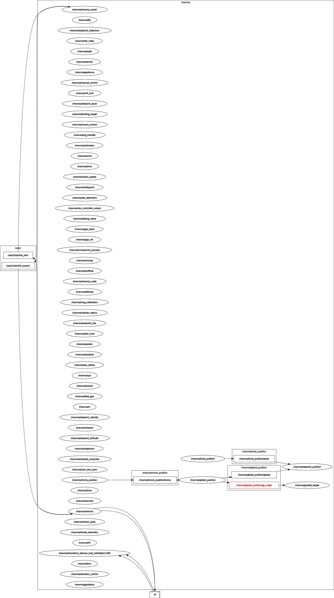

# offboard-control

PX4 Offboard Control Example by Using MAVROS and ROS2.

[demo video](doc/offboard-demo.mp4)

 

# Install ROS2

```bash
#
sudo apt install ros-humble-desktop
# colcon
sudo apt install ros-dev-tools
#Set up your environment
source /opt/ros/humble/setup.bash
```

# Install MAVROS

```bash
sudo apt install ros-humble-mavros
sudo apt install ros-humble-mavros-extras
```

# Create offboard-control node

```bash
# clone offical example
git clone https://github.com/ros2/examples src/examples -b humble

# build offical example
colcon build
```

Copy and paste this repo's source file content to offical example anyone your like, such as `examples_rclcpp_minimal_client` 

```
# build again
colcon build
```

# Launch MavROS

```bash
ros2 launch mavros px4.launch fcu_url:="udp://:14540@192.168.1.36:14557"
```

# Launch offboard-control node

```bash
ros2 run  examples_rclcpp_minimal_client client_main
```

# Launch Gazebo SITL

```bash
make px4_sitl gazebo
```

# Launching on hardware(Jetson NX)

```bash

```

# Trouble shooting


# Reference
[PX4 Offboard Mode](https://docs.px4.io/main/en/flight_modes/offboard.html)
