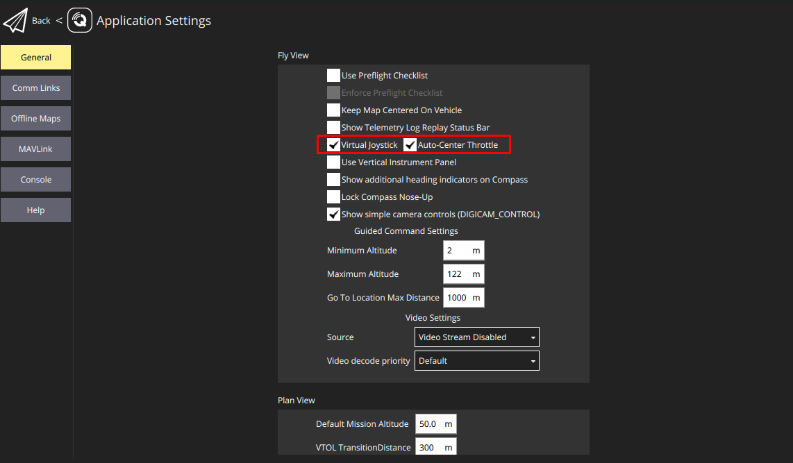

# offboard-control

PX4 Offboard Control Example by Using MAVROS and ROS2.

<video width="320" height="240" controls>
  <source src="doc/offboard-demo.mp4" type="video/mp4">
</video>

# Install ROS2

# Install MAVROS

# Create offboard-control node

# Launch MavROS

# Launch offboard-control node

# Launch Gazebo SITL

# Launching on hardware(Jetson NX)

# Trouble shooting

# Reference
